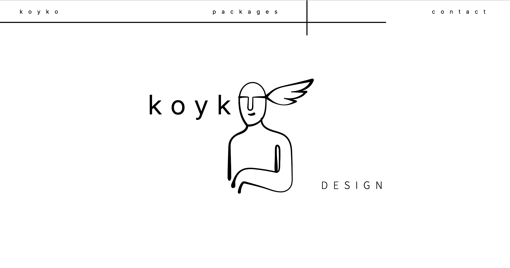

# Hi, I'm Valentino 👋

**Full-Stack Developer & Web Designer** · Bristol, UK  
Recently graduated · Python · Django · JavaScript · React

---

## 🧠 Koyko Design — Main Project

> A freelance web design and development practice built for small businesses and creatives.

Koyko Design is a studio focused on building custom, high-performance websites — giving clients full code ownership.

www.koykodesign.com

**Stack:**

**Highlights:**
- Custom-coded 
- Minimal, functional design with purposeful interactivity
- Deployed on Vercel with global CDN delivery
- SEO foundations built into every project
- Client code ownership — no recurring platform fees

---

## 🛠️ Tech Stack

**Frontend**  

**Backend**  

**Tools & Design**  

---

## 🎓 Education

**Full-Stack Development** — Code Institute / University of West of Scotland · 2026  
**Mixing & Mastering Engineering** — London School of Sound · 2021

---

## 🌍 Languages

Spanish · English · French · Portuguese · Italian

---

## 📫 Get in touch

